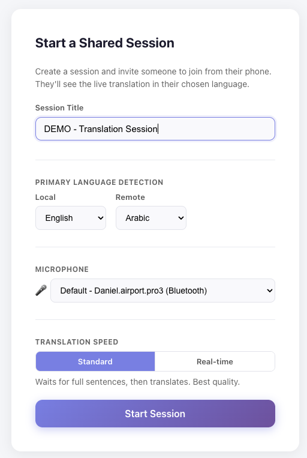
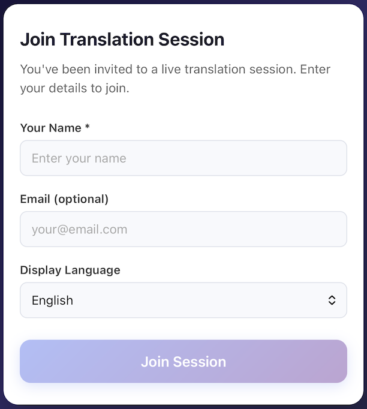
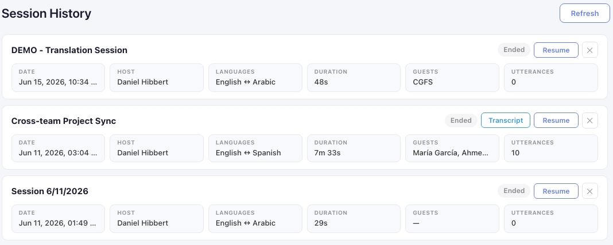
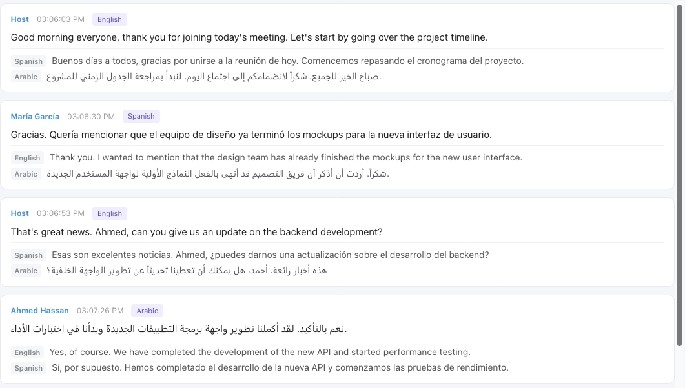
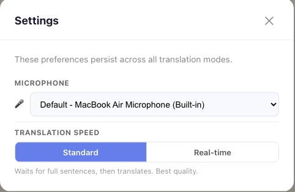

# Live Translation

Real-time multilingual conversation platform powered by Azure Cognitive Services. Speak in one language, hear and read translations in another — instantly. Share sessions with guests via QR code so anyone can follow along in their preferred language.

<!-- Screenshot: Main session view showing two-language conversation with live transcription -->


## Features

### Real-time Speech Recognition

Continuous transcription powered by Azure Speech Services. Supports automatic language detection from 50+ languages or manual language selection. Audio streams directly from the browser microphone — no plugins or extensions required.

### Live Translation

Instant translation between 10+ supported languages via Azure Translator. Choose between two modes:

- **Standard mode** — Sentence-level translation with higher accuracy
- **Real-time mode** — Streaming translation with lower latency, words appear as you speak

### Text-to-Speech Playback

Tap any utterance to hear it spoken aloud in the translated language. Uses Azure Neural Voices for natural-sounding speech synthesis.

### Guest Sharing

Invite anyone to follow along — no account required. Guests use their own device's microphone to capture audio locally, so each participant gets the best possible input from their own hardware rather than relying on a single shared mic across the room.

1. Click **Invite** to generate a shareable link with QR code
2. Guests scan the QR code or open the link on any device — phone, tablet, or laptop
3. Guests choose their preferred language and speak into their own microphone
4. Everyone sees live translations in real time, powered by each device's local audio

<!-- Screenshot: Guest view on mobile device -->


### Session Recording & History

Every conversation is automatically saved with full transcript replay.

- Browse past sessions by date, duration, and participant count
- Replay transcripts with synchronized audio playback
- Export conversations as JSON or formatted text

<!-- Screenshot: Session history list view -->


<!-- Screenshot: Session replay/detail view -->


### Multi-Speaker Support

Color-coded speakers with customizable labels make it easy to follow who said what in multi-participant conversations.

### Audio Recording

Record raw microphone audio alongside transcripts. Audio chunks are stored in Azure Blob Storage and linked to session history for later playback.

## How It Works

### Host a Session

1. Sign in with your Microsoft account
2. Select your languages (e.g., English ↔ Arabic)
3. Click **Start Listening** to begin real-time transcription
4. Speak naturally — translations appear instantly in both language panels

<!-- Screenshot: Split view with active transcription showing original and translated text -->


### Review Past Sessions

1. Navigate to the **History** tab
2. Browse past sessions with dates, durations, and participant counts
3. Click any session to replay the full transcript
4. Play back recorded audio alongside the transcript

### Configure Settings

- **Microphone selection** — Choose your preferred input device
- **Translation mode** — Switch between Standard and Real-time translation
- **Detection mode** — Auto-detect spoken language or manually specify

<!-- Screenshot: Settings page -->


## Quick Start

```bash
git clone https://github.com/your-org/live-translation.git
cd live-translation
npm install && cd api && npm install && cd ..
cp .env.example .env   # Fill in your Azure resource values
npm run dev             # https://localhost:5173
```

See the [Development Guide](docs/DEVELOPMENT.md) for full setup instructions.

## Documentation

| Document | Description |
|----------|-------------|
| [Architecture](docs/ARCHITECTURE.md) | System overview, component details, security model, project structure |
| [Development](docs/DEVELOPMENT.md) | Local setup, scripts, testing, Docker |
| [Infrastructure](docs/INFRASTRUCTURE.md) | Terraform provisioning, Azure resources, variables, cost estimate |
| [Deployment](docs/DEPLOYMENT.md) | Frontend & API deployment, CI/CD setup, post-deploy checklist |

## License

MIT — see [LICENSE](LICENSE).
